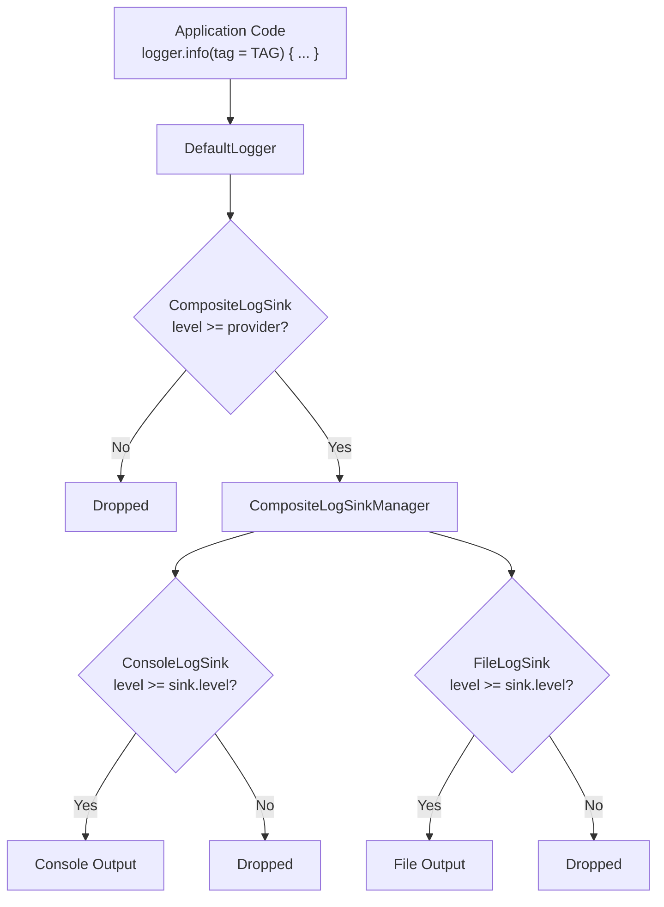

# Logging

Logging library for Thunderbird mobile applications.

## Modules

- `net.thunderbird.components.core.logging:core` provides the logging API, composite sink, and platform console sink.
- `net.thunderbird.components.core.logging:file` adds FileKit-backed file logging.
- `net.thunderbird.components.core.logging:testing` provides `TestLogger` and `TestLogLevelManager` for application tests.

### Dependency setup

Using the Thunderbird Mobile Components BOM (recommended):

```kotlin
// build.gradle.kts
dependencies {
    implementation(platform("net.thunderbird.components:bom:<version>"))
    implementation("net.thunderbird.components.core.logging:core")
    implementation("net.thunderbird.components.core.logging:file")
    testImplementation("net.thunderbird.components.core.logging:testing")
}
```

Or declaring individual artifact versions:

```kotlin
// build.gradle.kts
dependencies {
    implementation("net.thunderbird.components.core.logging:core:<version>")
    implementation("net.thunderbird.components.core.logging:file:<version>")
    testImplementation("net.thunderbird.components.core.logging:testing:<version>")
}
```

## Basic logging

Create a default console logger instance using `Logging.create()` and log messages using standard severity methods (`verbose`, `debug`, `info`, `warn`, `error`). Every log call requires an explicit tag. Console sinks use that tag without inspecting the stack trace.

```kotlin
import net.thunderbird.components.core.logging.Logging

const val TAG = "Application"
val logger = Logging.create()

logger.info(tag = TAG) { "Application started" }
logger.info(tag = TAG) { "Application initialized" }
logger.error(tag = TAG, throwable = error) { "Unable to load account" }
```

`DefaultLogger` evaluates a message lambda only when its sink accepts that level.

### Log levels

Log levels are ordered by priority. Sinks process events at or above their configured level threshold:

| Level | Priority | Description & Typical Usage |
|---|---|---|
| `VERBOSE` | 1 | Fine-grained trace logs and low-level diagnostic details. |
| `DEBUG` | 2 | Detailed information useful for development and troubleshooting. |
| `INFO` | 3 | General operational messages about normal application flow and lifecycle events. |
| `WARN` | 4 | Unexpected occurrences or recoverable conditions that do not halt functionality. |
| `ERROR` | 5 | Errors, exceptions, or critical failures requiring investigation. |

## Composing and managing sinks

```kotlin
import net.thunderbird.components.core.logging.DefaultLogger
import net.thunderbird.components.core.logging.LogLevel
import net.thunderbird.components.core.logging.composite.CompositeLogSink
import net.thunderbird.components.core.logging.console.ConsoleLogSink

val compositeSink = CompositeLogSink(
    logLevelProvider = { LogLevel.DEBUG },
    sinks = listOf(ConsoleLogSink(LogLevel.DEBUG)),
)

val logger = DefaultLogger(compositeSink)
```

The composite accepts events at or above its `logLevelProvider` threshold. It forwards each accepted event only to sinks whose own level accepts it.



Implement `LogSink` to send events to another destination.

### Enabling and disabling a logger

Use `ToggleableLogger` when an application needs to disable a logger without changing its log level or sinks.
Disabling it drops events before message lambdas are evaluated without affecting other logger instances.

```kotlin
val mainLogger = ToggleableLogger(DefaultLogger(compositeSink), enabled = false)
mainLogger.setEnabled(true)
```

### Dynamic sink management

Use `CompositeLogSink.manager` to add or remove log sinks dynamically at runtime:

```kotlin
// Dynamically attach or detach a sink (e.g., when enabling file logging or remote telemetry)
compositeSink.manager.add(fileSink)
compositeSink.manager.remove(fileSink)
```

### Dynamic log levels

Implement `LogLevelProvider` or use `LogLevelManager` to dynamically control log thresholds at runtime (e.g., via developer settings):

```kotlin
val levelManager: LogLevelManager = ... // e.g., TestLogLevelManager or custom implementation

// Override log level dynamically
levelManager.override(LogLevel.VERBOSE)

// Restore default level
levelManager.restoreDefault()
```

## File logging

The `file` artifact uses FileKit's `PlatformFile` directly. Obtain a writable `PlatformFile` in your application's platform-specific storage code, then pass it to the sink:

```kotlin
import io.github.vinceglb.filekit.PlatformFile
import net.thunderbird.components.core.logging.LogLevel
import net.thunderbird.components.core.logging.file.FileLogSink

fun createFileSink(logFile: PlatformFile): FileLogSink = FileLogSink(
    level = LogLevel.DEBUG,
    file = logFile,
)
```

Initialize FileKit first on platforms that require it, and create the file's parent directory before constructing the sink.

Call `flush()` before shutdown. `export(destination)` preserves the log; `exportAndClear(destination)` clears it only after a successful copy. Provide a `LoggingErrorReporter` to observe asynchronous write failures.

### Platform support

| Sink | Android | JVM | iOS (device and simulator) | WebAssembly (Wasm/JS) |
|---|---|---|---|---|
| `ConsoleLogSink` (`core`) | Supported | Supported | Supported | Supported |
| `FileLogSink` (`file`) | Supported | Supported | Supported | Unsupported |

Wasm/JS file logging is unsupported: creating `FileLogSink` throws `UnsupportedOperationException`. Supporting browser file APIs would require a separate web-specific design rather than the same filesystem behavior as the non-web sink.

## Testing

Depend on the `testing` artifact in test configurations and use `TestLogger` to record emitted events.

```kotlin
import net.thunderbird.components.core.logging.testing.TestLogger
import kotlin.test.Test
import kotlin.test.assertEquals

class MyComponentTest {

    @Test
    fun `logs state change`() {
        val testLogger = TestLogger()

        testLogger.info(tag = TAG) { "Processing item" }

        // Inspect captured events
        assertEquals(1, testLogger.events.size)
        assertEquals("Processing item", testLogger.events.first().message)

        // Print formatted logs to stdout for debugging
        testLogger.dump()
    }

    private companion object {
        const val TAG = "MyComponentTest"
    }
}
```

Use `net.thunderbird.components.core.testing.TestClock` when deterministic timestamps are needed. `TestLogLevelManager` is also available for testing log level override behaviors.

## Troubleshooting

If no messages appear, check the configured levels. With a composite sink, both the provider and each destination sink must accept the event's level. To inspect filtered messages, temporarily set the relevant levels to `VERBOSE`.

## Provenance & Authorship

Extracted and adapted from [thunderbird-android](https://github.com/thunderbird/thunderbird-android).
Authorship matches configured safe author rules for imported files. Files that did not pass the authorship check were excluded.
Source: https://github.com/thunderbird/thunderbird-android/tree/b0e24c8fc34db63d8e4ec118f77132ba5f6cd083/core/logging
